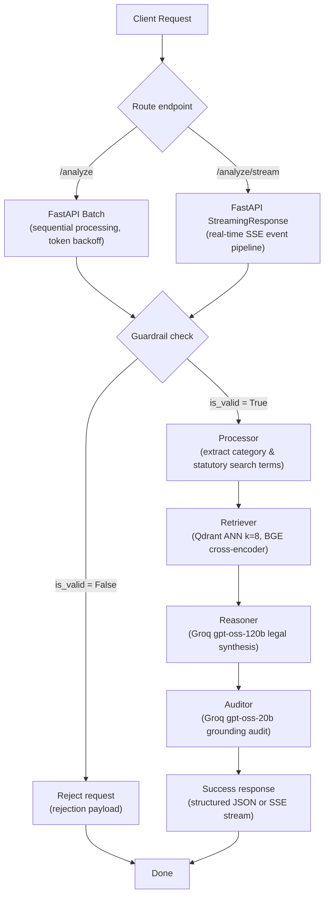

# InsafDost AI Backend

> **Live Demo:** [insafdostai.vercel.app](https://insafdostai.vercel.app)

Asynchronous REST API and state-graph execution engine for automated Pakistani legal reasoning, precedent retrieval from Qdrant, and factual consistency auditing.

---

## Technical Overview

The application processes legal scenarios through an asynchronous LangGraph execution pipeline. Inbound text is validated through a fail-closed classification guardrail, categorized into civil, criminal, or family jurisdictions, queried against a dense vector store of Pakistani case law, reranked via a cross-encoder, synthesized into an appellate litigation strategy, and factually audited before response serialization.

The service exposes both a synchronous batch endpoint (`/analyze`) and a real-time Server-Sent Events (SSE) streaming endpoint (`/analyze/stream`) to track node-by-node execution state dynamically.



---

## System Architecture

* **Decoupled Lifecycle Initialization:** Model downloads run inside an `asyncio.create_task` during the FastAPI lifespan context. Liveness probes respond immediately during startup without triggering orchestration timeout terminations.
* **Fail-Closed Guardrails:** The guardrail node employs defensive JSON parsing with fallback inspection across boolean keys. If the classification model returns malformed data or fails, the pipeline sets `is_valid = False` and terminates progression.
* **Two-Stage Retrieval Pipeline:** Performs approximate nearest-neighbor search against the Qdrant `pakistan_law` collection, followed by cross-encoder reranking via `BAAI/bge-reranker-base`. Cross-encoder matrix calculations run in a worker thread via `asyncio.to_thread` to prevent event loop blocking. Logits are mapped to probabilities via sigmoid activation and filtered at a calibrated threshold (`prob >= 0.40`).
* **Real-Time Execution Streaming (SSE):** The `/analyze/stream` endpoint consumes LangGraph's `astream(stream_mode="updates")` to yield discrete event frames (`case_start`, `node_start`, `node_complete`, `case_complete`, `done`). It emits `X-Accel-Buffering: no` headers to bypass reverse-proxy buffering on Hugging Face Spaces.
* **Rate-Limit Pacing:** Requests execute sequentially with a 2-second inter-case buffer and exponential backoff retry handling upon receiving HTTP 429 status codes from Groq.
* **Markdown Formatting Constraints:** The reasoning prompt restricts Markdown tables and pipe characters (`|`), mandating bulleted lists to prevent frontend parsing failures.

---

## The benchmark

`benchmarks/dataset.py` contains a 350-sample empirical testbed spanning the three core execution subsystems: 200 colloquial legal queries across 20 statutory frameworks, 100 input guardrail cases (50 genuine disputes, 25 out-of-domain queries, 25 adversarial prompt injections), and 50 statutory grounding audits (20 grounded opinions, 15 procedural extrapolations, 15 fabricated statutes). The retrieval testbed intentionally omits statute titles, acts, and section numbers to evaluate true semantic retrieval against raw, messy user phrasing.

```bash
python -m benchmarks.benchmark
```

This runs all 350 test cases through the decoupled subsystems, records per-query execution latencies, calculates statistical classification and retrieval metrics, and serializes the complete telemetry payload to `benchmarks/results.json`.

### Results

Evaluated on `openai/gpt-oss-20b` (temperature 0.0), `sentence-transformers/all-MiniLM-L6-v2`, and `BAAI/bge-reranker-base` on CPU against Qdrant Cloud (`pakistan_law`). Total wall-clock runtime: 1,348.26s.

#### 1. Retrieval Engine Performance (N = 200 Queries)

| Metric | Dense Search (k=8) | Dense + BGE-Reranker | Absolute Delta | Relative Delta |
| --- | --- | --- | --- | --- |
| Hit@1 | 31.5% | 37.5% | +6.0% | +19.0% |
| Hit@3 | 47.0% | 49.5% | +2.5% | +5.3% |
| Hit@5 | 55.0% | 55.5% | +0.5% | +0.9% |
| MRR@3 | 0.383 | 0.428 | +0.045 | +11.7% |
| Mean Latency | 2124.14ms | 2124.14ms | - | - |
| P95 Latency | 2451.64ms | 2451.64ms | - | - |

Cross-encoder reranking surfaced relevant authorities to Rank 1 on 12 queries that dense retrieval missed, yielding a +19.0% relative improvement in Hit@1 (31.5% to 37.5%) and driving MRR@3 from 0.383 to 0.428.

#### 2. Input Guardrail Classification (N = 100 Cases)

| Metric | Measured Value | Target Benchmark |
| --- | --- | --- |
| Precision | 1.000 | Zero out-of-domain leakage |
| Recall | 0.980 | Valid dispute retention |
| F1-Score | 0.990 | Harmonic balance |
| Adversarial Rejection Rate | 100% (25/25) | Immune to jailbreaks/injections |
| Accuracy | 99% (99/100) | Overall classification accuracy |
| Mean Latency | 512.03ms | Sub-second gateway gating |
| P95 Latency | 819.73ms | Bounded gateway tail latency |

The fail-closed gateway rejected 25 of 25 out-of-domain inputs and 25 of 25 adversarial prompt injections, preventing downstream token consumption on Groq reasoning models.

#### 3. Factual Grounding Auditor (N = 50 Audits)

| Metric | Score | Evaluation Target |
| --- | --- | --- |
| Mean Grounded Score | 0.853 | Faithful citation of authority |
| Mean Hallucinated Score | 0.073 | Penalization of fabricated statutes |
| Discrimination Gap | 0.780 | Mathematical separation delta |
| Hallucination Rejection Rate | 100% (15/15) | Scored <= 0.10 on fake laws |
| Mean Latency | 852.26ms | Single-pass SLM audit |
| P95 Latency | 1329.46ms | Verification latency ceiling |

The auditor established a 0.780 score separation between grounded doctrine and fabricated statutes. All 15 synthetic hallucinations scored 0.10 or lower, eliminating the silent masking defect where unverified responses previously defaulted to 0.85.

### Where the model succeeds and where it doesn't
Retrieval precision splits across query structure. On statutory terms with distinctive legal terminology (e.g., dishonestly issuing a cheque, narcotics commercial quantity, temporary injunction stay order), the pipeline achieved 90% to 100% Hit@3. Conversely, on descriptive, narrative grievances (e.g., specific performance of oral property contracts, commercial dispute damages quantification), dense retrieval dropped to 0% to 20% Hit@3. The BAAI/bge cross-encoder rescued edge cases where dense similarity ranked statutory sections between ranks 4 and 8, but it cannot rescue instances where dense search fails to surface the document within the initial top-8 candidate window.

The guardrail produced one false negative out of 100 test cases: Case 26 ("Recovery of damages under Fatal Accidents Act 1855 for hospital surgical negligence") was classified as invalid (is_valid: false). Because the prompt enforces strict boundaries against non-legal and administrative queries, ambiguous tort-based claims lacking explicit criminal or tenancy terminology risk rejection.

The auditor demonstrated consistent discrimination against synthetic statutes: 15 out of 15 fabricated legal citations scored between 0.00 and 0.10. Grounded opinions averaged 0.853, with minor score penalties (0.40 to 0.60) applied to procedural extrapolations (e.g., requiring bank ledger subpoenas or postal tracking receipts not explicitly stated in statutory excerpts).  

## Reliability guardrails

Specific failure modes identified during benchmarking are handled structurally:

- **Conversational JSON leaks:** `gpt-oss-20b` occasionally prefixes JSON with conversational text. The parser uses strict regex extraction (`\{.*\}`) and enforces fail-closed execution (`is_valid = False`) if decoding fails.
- **Event loop blocking during reranking:** Running cross-encoder forward passes on CPU blocks the FastAPI event loop. Matrix calculations are thread-offloaded via `asyncio.to_thread` to maintain HTTP liveness probe responsiveness.
- **Silent verification failure:** Hardcoded fallback grounding scores have been eliminated. Unparseable or empty auditor responses fail closed to a 0.0 grounding score.

---

## Directory Structure

```text
InsafDostBackend/
├── app/
│   ├── core/
│   │   ├── __init__.py
│   │   └── config.py          # Pydantic BaseSettings environment validation
│   ├── services/
│   │   ├── __init__.py
│   │   └── vectorstore.py     # Qdrant client connection and HuggingFaceEmbeddings
│   ├── workflows/
│   │   ├── __init__.py
│   │   └── graph.py           # LangGraph StateGraph, node logic, and routing
│   ├── __init__.py
│   └── main.py                # FastAPI app, lifespan handler, CORS, and endpoints
├── benchmarks/
│   ├── benchmark.py           # Unified execution harness (retrieval, guardrail, auditor)
│   ├── dataset.py             # 350-case empirical testbed (200 retrieval, 100 guardrail, 50 audit)
│   └── results.json           # Telemetry, latencies, MRR/Hit@k, and F1 logs
├── .dockerignore
├── .env.example
├── .gitattributes
├── .gitignore
├── Dockerfile                 # Container definition targeting Python 3.11-slim
├── LICENSE.md
├── ping_qdrant.py             # Qdrant cluster connectivity utility
├── README.md                  # System architecture, benchmarks, and API documentation
└── requirements.txt           # Pinned Python dependencies

```

---

## Dependencies and Runtime

| Component | Technology | Version / Target |
| --- | --- | --- |
| Runtime | Python | 3.11-slim |
| Web Framework | FastAPI | 0.136.1 |
| ASGI Server | Uvicorn | 0.46.0 |
| Workflow Engine | LangGraph | 1.1.10 |
| Legal Reasoning LLM | Groq API (`openai/gpt-oss-120b`) | Temperature 0.0 |
| Classification LLM | Groq API (`openai/gpt-oss-20b`) | Temperature 0.0 |
| Vector Store | Qdrant Cloud | Client 1.17.1 |
| Embedding Model | `sentence-transformers/all-MiniLM-L6-v2` | CPU |
| Cross-Encoder Reranker | `BAAI/bge-reranker-base` | CPU (512 max length) |
| Configuration Management | Pydantic Settings | 2.15.0 |

---

## Prerequisites

* Python 3.11
* Active Qdrant Cloud cluster with an initialized `pakistan_law` collection
* Groq API account with active API credentials

---

## Configuration

The service reads configuration values from environment variables via `app/core/config.py`.

Create a `.env` file in the project root:

```bash
cp .env.example .env

```

| Variable | Type | Default | Description |
| --- | --- | --- | --- |
| `GROQ_API_KEY` | string | None | Authorization key for Groq Cloud API endpoints. |
| `QDRANT_URL` | string | None | HTTPS endpoint URL of the Qdrant cluster. |
| `QDRANT_API_KEY` | string | None | API key for Qdrant Cloud authentication. |
| `ENVIRONMENT` | string | `production` | Deployment environment identifier. |

---

## Installation and Local Setup

1. Clone the repository:

```bash
git clone https://github.com/Abdurrafay19/insaf_dost_backend.git
cd insaf_dost_backend

```

1. Create and activate a Python 3.11 virtual environment:

```bash
python3.11 -m venv venv
source venv/bin/activate

```

1. Install dependencies:

```bash
pip install --no-cache-dir -r requirements.txt

```

1. Verify Qdrant connectivity:

```bash
python ping_qdrant.py

```

1. Run the development server:

```bash
uvicorn app.main:app --host 0.0.0.0 --port 7860 --reload

```

---

## API Reference

### Liveness Probe

Verifies that the ASGI web server is responsive.

```bash
curl -X GET http://localhost:7860/health

```

Expected response (`200 OK`):

```json
{
  "status": "healthy",
  "service": "InsafDost AI Gateway"
}

```

### Readiness Probe

Verifies whether model weights are loaded and the LangGraph pipeline is compiled.

```bash
curl -X GET http://localhost:7860/ready

```

Expected response when initialized (`200 OK`):

```json
{
  "status": "ready"
}

```

Expected response while loading (`503 Service Unavailable`):

```json
{
  "detail": "AI models are still loading."
}

```

### Real-Time Case Streaming (SSE)

Streams real-time pipeline execution progress, node transitions, and output payloads via Server-Sent Events (SSE). Use unbuffered output (`-N`) when testing via CLI.

```bash
curl -N -X POST http://localhost:7860/analyze/stream \
  -H "Content-Type: application/json" \
  -d '{
    "cases": [
      "A tenant refuses to vacate commercial premises in Lahore after the lease expired and defaults on 4 months rent."
    ]
  }'

```

Expected stream sequence (`text/event-stream`):

```text
data: {"type": "case_start", "case_num": 1, "total_cases": 1}

data: {"type": "node_start", "case_num": 1, "node": "guardrail", "label": "Validating legal dispute applicability"}

data: {"type": "node_complete", "case_num": 1, "node": "guardrail"}

data: {"type": "node_start", "case_num": 1, "node": "processor", "label": "Extracting statutory doctrines & search terminology"}

data: {"type": "node_complete", "case_num": 1, "node": "processor"}

data: {"type": "node_start", "case_num": 1, "node": "retriever", "label": "Querying Qdrant & executing cross-encoder rerank"}

data: {"type": "node_complete", "case_num": 1, "node": "retriever"}

data: {"type": "node_start", "case_num": 1, "node": "reasoner", "label": "Formulating appellate legal opinion"}

data: {"type": "node_complete", "case_num": 1, "node": "reasoner"}

data: {"type": "node_start", "case_num": 1, "node": "auditor", "label": "Auditing factual grounding score"}

data: {"type": "node_complete", "case_num": 1, "node": "auditor"}

data: {"type": "case_complete", "case_num": 1, "data": {"raw_text": "...", "is_valid": true, "category": "Civil", "legal_keywords": "...", "precedents": ["..."], "precedent_meta": [{"source": "...", "score": 0.52}], "final_answer": "...", "audit_score": 0.6, "_case_num": 1}}

data: {"type": "done"}

```

### Case Analysis (Synchronous Batch)

Processes a list of legal scenario texts through the classification, retrieval, reasoning, and auditing pipeline in a single synchronous response payload.

```bash
curl -X POST http://localhost:7860/analyze \
  -H "Content-Type: application/json" \
  -d '{
    "cases": [
      "A shopkeeper in Karachi used tampered weighing scales to shortchange customers and threatened physical violence when confronted."
    ]
  }'

```

Expected response (`200 OK`):

```json
{
  "status": "success",
  "data": [
    {
      "is_valid": true,
      "category": "Criminal",
      "legal_keywords": "Pakistan Penal Code Section 264 265 fraudulent weights Section 506 criminal intimidation",
      "precedents": [
        "Criminal Revision No. 412: In cases concerning fraudulent weights under Section 264 PPC..."
      ],
      "precedent_meta": [
        {
          "source": "Court Precedent",
          "score": 0.871
        }
      ],
      "final_answer": "### 1. Core Legal Issue\n\nWhether the use of fraudulent balance scales constitutes an offense under Section 264/265 of the Pakistan Penal Code (PPC) and whether verbal threats constitute criminal intimidation under Section 506 PPC.\n\n### 2. Applicable Law & Precedents\n\n- [1] Criminal Revision No. 412 - Establishes evidentiary requirements for seizing weighing mechanisms.\n\n### 3. Case Analysis\n\nThe accused intentionally employed tampered measurement devices...\n\n### 4. Actionable Litigation Strategy\n\n- Forum: Judicial Magistrate 1st Class having local territorial jurisdiction.\n- Application: File formal complaint under Section 190 CrPC or direct FIR registration under Section 154 CrPC for cognizable offenses.\n- Evidence Required: Seizure memo of the scale verified by Inspector of Weights and Measures.",
      "audit_score": 0.92,
      "_case_num": 1
    }
  ]
}

```

---

## Container Deployment

The application includes a `Dockerfile` targeting containerized platforms and Hugging Face Spaces using non-root execution on port `7860`.

Build the image:

```bash
docker build -t insafdost-backend:latest .

```

Run the container:

```bash
docker run -d \
  --name insafdost-service \
  -p 7860:7860 \
  --env-file .env \
  insafdost-backend:latest

```

---

## License

Distributed under the MIT License. See `LICENSE.md` for details.
